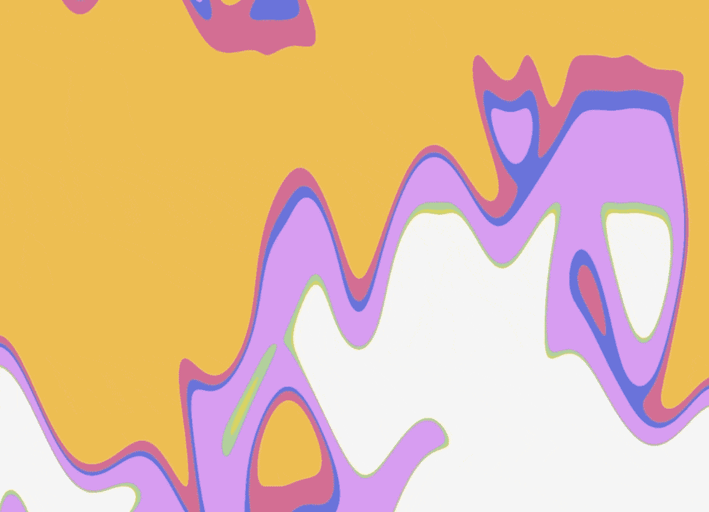
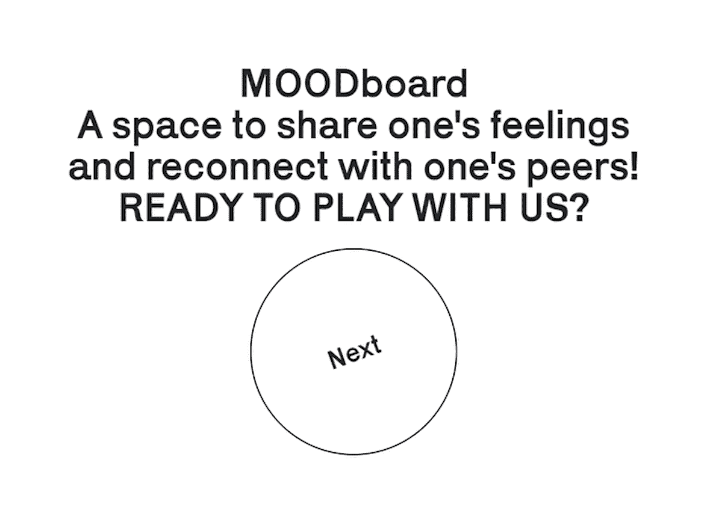
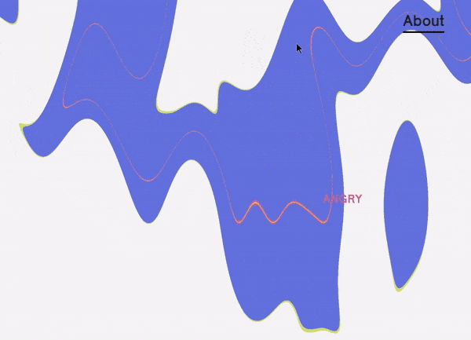

# MOODboard

**MOODboard** is a project built in p5.js for the course **Creative Coding** at the Politecnico di Milano. <br>
If you want to know more about the course visit [this website](https://drawwithcode.github.io/2020/).

### Faculty

* Michele Mauri
* Andrea Benedetti
* Tommaso Elli

### Team

* [Michele Bruno](https://github.com/michelebruno)
* [Federica Laurencio](https://federicalaurencio.bss.design/)
* [Valentina Pallacci](https://www.linkedin.com/in/valentina-pallacci/)
* [Federico Pozzi](https://federicopozzi.github.io/portfolio/index.html)

### Table of Contents

1. [Concept](#concept)
  * Project idea
  * Communication aim
  * Context of use
  * Device

2. [Design and coding challenges](#Design-and-coding-challenges)
  * Face recognition
    * Coding challenges
  * Background
    * Coding challenges

3. [Miscellaneus](#miscellaneus)
  * Heroku
  * CSS
  * Sharingbutton.io
  * ES6 features

4. [Credits](#credits)

## Concept

### Project idea

Users can see an **algorithmic representation** of their expression (neutral, happy, angry, sad, disgusted, surprised, fearful) that changes shape and color based on how they are feeling during that time. The representation is updated in **real-time**. Every user will be positioned according to their expression, creating **groups** based on shared emotion. The background will show a **generative artwork** that changes according to everyone's expression and the number of participants.

<br>

### Communication aim

The main goal was to create an **interactive experience** where users can reconnect with their peers and other anonymous surfers through their emotions, to enable speculation around the theme of **sentient algorithms**.

### Context of use

### Device

We preferred to stick to **desktop or landscape mobile** because on portrait mobile the space was not enough for the experience. Besides the main frameworks and languages as HTML, CSS, p5.js, and socket.io, we used other libraries to achieve our goals, in particular [face-api.js](https://github.com/justadudewhohacks/face-api.js/).

## Design and coding challenges

### Face recognition

The [face-api.js](https://justadudewhohacks.github.io/face-api.js/docs/index.html#models-face-expression-recognition) library was used for facial recognition.

#### Palette

Then we decided on a palette that resonated with the mood we envisioned for the project, while also trying to use colors that were commonly coded with the emotions used.

<br>

### Coding challenges

#### Algorithmic representation

First, we gave shape to the landmarks by connecting them with a stroke.

```js
const col = palette[this.feeling];
stroke(col);

noFill();
// rect(0, 0, this.dimensions.w, this.dimensions.h);
strokeWeight(5);
this._drawElement(this.leftEyebrow, false);
this._drawElement(this.rightEyebrow, false);
this._drawElement(this.nose, false);
this._drawElement(this.leftEye);
this._drawElement(this.rightEye);
this._drawElement(this.mouth);
noStroke();
```

A **white background** was then applied to each avatar to ensure that the features were always recognisable and did not get lost in the background texture. To stay in line with our sketchy visual identity, we used `noise()` function.

```js
class Player {
  drawPotato() {
    const larg = this.dimensions.w;
    const alt = this.dimensions.h;

    push();
    noStroke();
    /**
     * alt/2.5 for centring the face
     */
    translate(larg / 2, alt / 2.5);
    scale(1, 1.2);

    const noiseDivider = 3;
    beginShape();
    for (let i = 0; i < 15; i++) {
      const a = TWO_PI * i / 15;
      const noiseX = (noise(a, frameCount / 20) - .5) / noiseDivider;
      const noiseY = (noise(a, frameCount / 20) - .5) / noiseDivider;
      vertex((cos(a) + noiseX) * larg / 2, (sin(a) + noiseY) * alt / 2);
    }
    endShape(CLOSE);
    pop();
  }
}
```

When socket receives the data it assigns it to the corresponding player.

```js
socket.on('player.left', onPlayerLeft);

function onPlayerLeft(id) {
  console.info('Player ' + id + ' left');
  players.delete(id);
}
```

Detect performs facial recognition.

```js
async function detectFace() {
  if (!me) {
    console.warn('Probabilmente non c\'è ancora una connessione al server. Riproverò fra un secondo.');
    return setTimeout(detectFace, 500);
  } else if (!video) { // La cam non è attiva.
    console.warn('Probabilmente il permesso della webcam non è ancora stato concesso. Riproverò fra un secondo.');
    return setTimeout(detectFace, 1000);
  }

  detection = await faceapi.detectSingleFace(video.elt,
    detectionOptions).withFaceLandmarks().withFaceExpressions();
```

If face-api.js finds a face but has a degree of certainty lower than the threshold value, detection starts again.

```js
  if (detection) {
  const threshold = .8;

  const score = detection.detection._score;

  if (score < threshold) {
    DEBUG_MODE && console.debug('Uncertain detection');
    return detectFace();
  }

  me.detection = detection;

  me.broadcast();

```

Initially, face-api recognised many expressions as neutral. We therefore tried to **decrease the neutrals**, favouring other expressions:

```js
for (const feeling of feelings) {
  const value = feeling === 'neutral' ? expressions[feeling] * .4 : expressions[feeling];

  if (value > this.feelingValue) {
    this.feeling = feeling;
    this.feelingValue = value;
  }
}
```

The position of the avatar is calculated by the browser of each user, making the site faster. The position is calculated on the basis of gravity points that [apply forces to points](https://www.youtube.com/watch?v=MkXoQVWRDJs&ab_channel=TheCodingTrain) with the same feeling.

This class generates the **centres of gravity** of the emotions.

```js
class GravityPoint {
  constructor({feeling}) {
    this.feeling = feeling;
    this.setPosition();
  }

  run() {

    const filteredPlayers = [];

    for (const [, player] of players) {
      player.feeling === this.feeling && filteredPlayers.push(player);
    }

    for (const other of filteredPlayers) {
      /**
       *
       * @type {p5.Vector} force
       */
      const force = p5.Vector.sub(this.pos, other.pos);

      const distance = force.mag();

      if (distance > 10) {
        force.setMag(G * other.feelingValue * 40 / distance);
        other.acc.add(force);
      } else other.stop();
    }

    started && this.feeling !== 'neutral' && this.draw();
  }

  draw() {
    push();
    let col = color(palette[this.feeling]);
    fill(col);
    textAlign(CENTER);
    textSize(23);
    text(this.feeling.toUpperCase(), this.pos.x, this.pos.y + 20);
    pop();
  }
```

Set the position of the **centre of gravity**.

```js
  setPosition()
{
  let hUnit = height / 8;

  switch (this.feeling) {
    case 'neutral':
      this.pos = createVector(4 * width / 8, 4 * hUnit);
      break;
    case 'surprised':
      this.pos = createVector(1 * width / 8, 3 * hUnit);
      break;
    case 'happy':
      this.pos = createVector(4 * width / 8, 1 * hUnit);
      break;
    case 'angry':
      this.pos = createVector(7 * width / 8, 3 * hUnit);
      break;
    case 'disgusted':
      this.pos = createVector(7 * width / 8, 5.5 * hUnit);
      break;
    case 'sad':
      this.pos = createVector(4 * width / 8, 7 * hUnit);
      break;
    case 'fearful':
      this.pos = createVector(1 * width / 8, 5.5 * hUnit);
      break;
    default:
      console.warn(this.feeling + " is not a valid expression.")
      break;
  }
}
```

### Background

For the background, we decided very early in development that we wanted to design a **responsive generative artwork**.The artwork needed to further the connection between the users and their algorithmic representation. In order to achieve this result, we decided that we needed to show the **sum of the emotions** of every person in the room at any given time.



#### Coding challenges

After exploring the possibilities of p5.js in this scenario, we landed on an interesting project on [openprocessing.org](https://www.openprocessing.org/).
The [sketch](https://www.openprocessing.org/sketch/892960) seemed really fluid for a p5js project. In fact, we discovered that the main design was a **shader** coded in [GLSL](https://en.wikipedia.org/wiki/OpenGL_Shading_Language), a language that allows complex results with little computational load. In order to understand GLSL, we used *[The book of shaders](https://thebookofshaders.com/)* and [GLSL Sandbox](http://glslsandbox.com/). On GLSL Sandbox we found some shaders that had snippets that allowed us to get closer to our desired output. We used [this sketch](http://glslsandbox.com/e#70144.0) to be able to use the RGB color model instead of the default GLSL model. We then found [this sketch](http://glslsandbox.com/e#68868.0) which had an interesting parametric animation that we then modified to fit our needs.

The last hurdle we had was to pass information between the sketch and the shader. Thankfully in *The book of shaders* we discovered the possibility to set a uniform from an external code. On the p5js documentation then we finally found the [method](https://p5js.org/examples/3d-passing-shader-uniforms.html) to connect shaders and p5js sketches.

Using the data from Face.api we created **seven uniforms** connected with each emotion. In the shader the emotions are shown as an array of horizontal stripes that grow with the variable. The stripes are then animated with a **parametric equation**.

```glsl
uniform float time;
uniform vec2 resolution;

uniform float neutral;
uniform float happy;
uniform float sad;
uniform float angry;
uniform float fearful;
uniform float disgusted;
uniform float surprised;

const vec3 YELLOW = RGB(254.0, 190.0, 67.0);
const vec3 PINK = RGB(239.0, 108.0, 148.0);
const vec3 VIOLET = RGB(235.0, 154.0, 244.0);
const vec3 BLUE = RGB(83.0, 116.0, 231.0);
const vec3 WGREEN = RGB(216.0, 213.0, 85.0);
const vec3 CGREEN = RGB(117.0, 214.0, 144.0);
const vec3 GRAY = RGB(244.0, 244.0, 244.0);

vec3 band(vec2 pos) {
  float y = abs(pos.y) - 0.0;

  if (y < happy) return YELLOW;
  if (y < happy+angry) return PINK;
  if (y < happy+angry+sad) return BLUE;
  if (y < happy+angry+sad+fearful) return VIOLET;
  if (y < happy+angry+sad+fearful+disgusted) return CGREEN;
  if (y < happy+angry+sad+fearful+disgusted+surprised) return WGREEN;

  return GRAY;
}

void main() {
  vec2 position = (gl_FragCoord.xy / resolution.xy * 1.5) - vec2(0.0, 2.7);
  float X = position.x*20.;
  float Y = position.y*20.;
  float t = time*0.6;
  float o = sin(+cos(t+X/1.)+t+Y/6.-sin(X/(5.+cos(t*.1)-sin(X/10.+Y/10.))));

  gl_FragColor = vec4(band(position + vec2(0., cos(position.x*4. + o + time))), 4.0);
}
```

In order to have a **smoother transition** between each background state, we interpolated the parameters from Face.api
that we had previously set to refresh every second.

```js
setInterval(function() {
 const nextFeelings = {
   neutral: 0, happy: 0, sad: 0, angry: 0, fearful: 0, disgusted: 0, surprised: 0,
 };

 for (const [, player] of players) {
   if (player.feelings) {
     for (const feeling of feelings) {
       nextFeelings[feeling] += player.feelings[feeling];
     }
   }
 }

 summedFeelings.prev = summedFeelings.next;
 summedFeelings.next = nextFeelings;
 summedFeelings.lastTimestamp = Date.now();
}, summedFeelings.interval);
```

In the p5 `draw()` function, the interpolated values are set to the shader with the `setUniform()` function.

```js
 const {prev, next, lastTimestamp, interval} = summedFeelings;
 if (prev && next) {
   bg.shader(bgShader);
   const now = Date.now();
   const amt = (now - lastTimestamp) / interval;
   for (const feeling of feelings) {
     const lerped = lerp(prev[feeling], next[feeling], amt);
     bgShader.setUniform(feeling, lerped);
   }
      bg.quad(-1, -1, 1, -1, 1, 1, -1, 1);
        bgShader.setUniform('time', millis() / 1000.0);
 }
}
```

The user also has the option of **saving** the background.

```html
<button class="menu btn btn-text p-0 cool-underlined" onclick="bg.saveCanvas('MOODboard', 'png')">Save</button>
```

## Miscellaneus

### Heroku

The perfect server turned out to be heroku as it allows you to have a working server directly connected to the github
repository facilitating the work and development of the web app.


### Bootstrap

In order to organize the structure of the webpage we used this css framework that helped and made much more easy this side of the project.


### CSS

In order to arrange the commands inside the canvas in html, bootstrap and pure css were used. Also for **colors** and
**dimension** of texts.



To style the interaction buttons to start the game, a **rotation animation** in css was used.

```css
@keyframes rotation {
 from {
   transform: rotate(359deg);
 }
 to {
   transform: rotate(0deg);
 }
}
```



Also the animations of the About and Save buttons are made in CSS.

```
bg-will-be-animated .bg-animation {
  width: 20px;
  height: 20px;
  top: 50%;
  left: 50%;
  background-color: #FEBE43;
  border-radius: 50%;
  transform: scale(0);
  z-index: -1;
  transition: 1s;
  transition-timing-function: cubic-bezier(0.13, 0, 0, 1);
}

.bg-will-be-animated:hover .bg-animation {
  transform: scale(15);
  transition: .6s;
}

.bg-will-be-animated:hover .cool-underlinedr::before
{
  visibility: visible;
  width: 0;
}
.bg-will-be-animated .cool-underlinedr::before  {
  content: "";
  position: absolute;
  width: 100%;
  height: 3px;
  bottom: -1px;
  right: 0;
  background-color: black;
  transition: .6s ease-in-out;
}
```


### Sharingbutton.io

To create the **sharing button** for the social, we used an [online tool](https://sharingbuttons.io/) which generates
HTML and CSS strings to be embedded in the website.

```html
<!-- Sharingbutton WhatsApp -->
<a class="resp-sharing-button__link" href="whatsapp://send?text=I&#x27;m%20inviting%20you%20to%20my%20shared%20emotions!%20https%3A%2F%2Fffmv-moodboard.herokuapp.com%2F" target="_blank" rel="noopener" aria-label="">
 <div class="resp-sharing-button resp-sharing-button--whatsapp resp-sharing-button--small"><div aria-hidden="true" class="resp-sharing-button__icon resp-sharing-button__icon--solid">
   <svg xmlns="http://www.w3.org/2000/svg" viewBox="0 0 24 24"><path d="M20.1 3.9C17.9 1.7 15 .5 12 .5 5.8.5.7 5.6.7 11.9c0 2 .5 3.9 1.5 5.6L.6 23.4l6-1.6c1.6.9 3.5 1.3 5.4 1.3 6.3 0 11.4-5.1 11.4-11.4-.1-2.8-1.2-5.7-3.3-7.8zM12 21.4c-1.7 0-3.3-.5-4.8-1.3l-.4-.2-3.5 1 1-3.4L4 17c-1-1.5-1.4-3.2-1.4-5.1 0-5.2 4.2-9.4 9.4-9.4 2.5 0 4.9 1 6.7 2.8 1.8 1.8 2.8 4.2 2.8 6.7-.1 5.2-4.3 9.4-9.5 9.4zm5.1-7.1c-.3-.1-1.7-.9-1.9-1-.3-.1-.5-.1-.7.1-.2.3-.8 1-.9 1.1-.2.2-.3.2-.6.1s-1.2-.5-2.3-1.4c-.9-.8-1.4-1.7-1.6-2-.2-.3 0-.5.1-.6s.3-.3.4-.5c.2-.1.3-.3.4-.5.1-.2 0-.4 0-.5C10 9 9.3 7.6 9 7c-.1-.4-.4-.3-.5-.3h-.6s-.4.1-.7.3c-.3.3-1 1-1 2.4s1 2.8 1.1 3c.1.2 2 3.1 4.9 4.3.7.3 1.2.5 1.6.6.7.2 1.3.2 1.8.1.6-.1 1.7-.7 1.9-1.3.2-.7.2-1.2.2-1.3-.1-.3-.3-.4-.6-.5z"/></svg>
 </div>
 </div>
</a>
```

The user will have a custom default message to invite his/her friends.


### ES6 features

#### Map

The [Map object](https://developer.mozilla.org/it/docs/Web/JavaScript/Reference/Global_Objects/Map) is a simple
key/value map. It makes loops easier and allows to retrieve quickly an item by its key.

```js
// Earlier in code.
// const players = new Map();

function onPlayerUpdated(id, feelings, landmarks, dimensions) {
  // Initiates a player if there isn't one from this socket id.
  if (!players.has(id)) {
    players.set(id, new Player({id, x: width / 2, y: height / 2}));
  }

  const player = players.get(id);

  player.expressions = feelings;
  player.dimensions = dimensions;

  player.landmarks = {
    _positions: landmarks,
  };
}
```

#### For...of

[For...of](https://developer.mozilla.org/en-US/docs/Web/JavaScript/Reference/Statements/for...of) was used to improve
the readability and to iterate `Map` objects.

```js
for (const feeling of feelings) {
 gravityPoints.set(feeling, new GravityPoint({feeling: feeling}));
}
```

## Credits

Font: [Karrik](https://velvetyne.fr/fonts/karrik/)
Libraries: P5js

## How to run

Be sure to have node installed: https://nodejs.org/

* install node dependencies: `npm install`
* run local server: `node server.js`
